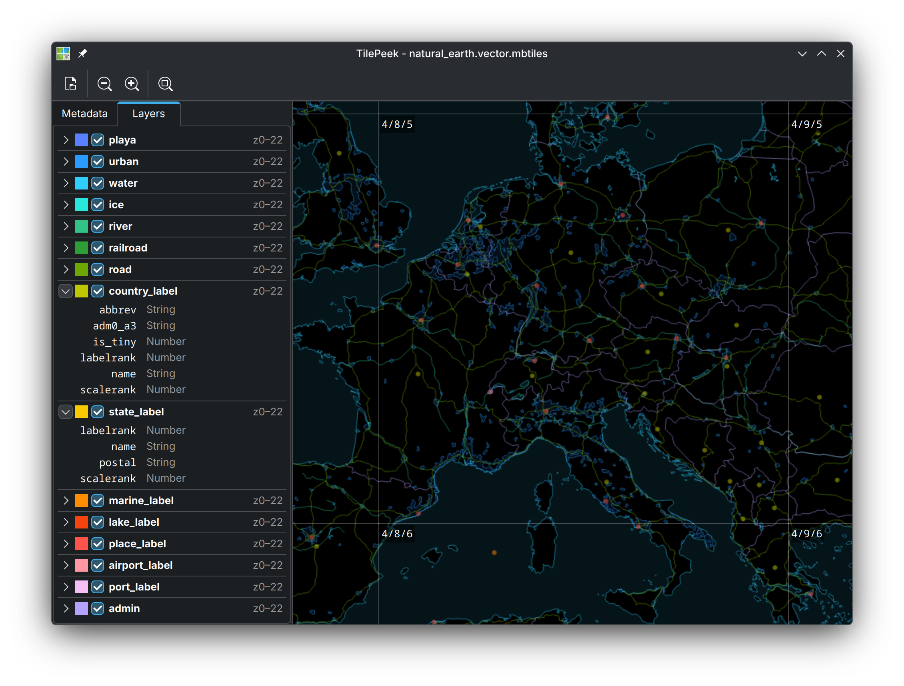

# TilePeek

TilePeek is a desktop application for previewing & inspecting map tilesets from local [MBTiles](https://docs.mapbox.com/help/glossary/mbtiles/) & [PMTiles](https://docs.protomaps.com/pmtiles/) files. For when you just need a quick peek and don't want to fire up a full session of QGIS or whatever.

> [!NOTE]
> There is no packaged release yet. Binaries for Linux will come soon, and hopefully MacOS & Windows shortly after.
> Until then feel free to compile it yourself to try it out & provide feedback.



## Feature overview

- Open local tilesets from MBTiles v1 & PMTiles v3 container formats
- View raster tiles in PNG, JPEG, WebP, and more image formats (provided by Qt)
- View vector tile data in [Mapbox Vector Tile (MVT)](https://github.com/mapbox/vector-tile-spec) v2 format
- View tileset metadata & tile statistics (sizes, counts)
- Optionally visualize tile boundaries, tile IDs, tile sizes, tileset bounds & center
- Inspect vector tile data in detail
    - View layer names, descriptions, fields
    - Click on individual map features to display properties
    - Focus individual tiles to reveal out-of-bounds buffer data and zoom in on details

## Build instructions

Install build dependencies:

- Fedora: `sudo dnf install cmake qt6-qtbase-devel`
- Ubuntu: `sudo apt install cmake qt6-base-dev`
- MacOS (with Homebrew): `brew install cmake qt@6`
- Windows: 🤷‍♂️ let me know

Compile, test, run:

```sh
cmake -B build
cmake --build build
ctest --test-dir build
./build/src/tilepeek
```
